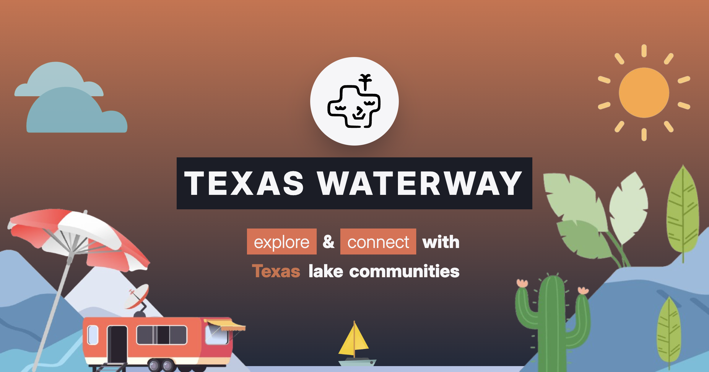

# TexasWaterway

**Live Demo:** [texaswaterway.com](https://texaswaterway.com)

  
  
  
  
  
  
  

**TexasWaterway** is a full-stack web application that serves as a **lake data and social platform for Texas lakes**. It provides a one-stop hub where lake enthusiasts can get real-time lake information (water levels, weather, historical trends, fish species) and engage with a community through events and social features.

## Table of Contents

- [Project Overview](#project-overview)  
- [Features](#features)  
  - [Real-Time Lake Data & Insights](#real-time-lake-data--insights)  
  - [Interactive Texas Lakes Map](#interactive-texas-lakes-map)  
  - [Fishing Species Guidance](#fishing-species-guidance)  
  - [User Profiles & Friend Connections](#user-profiles--friend-connections)  
  - [Lake Events & Community](#lake-events--community)  
  - [Authentication & Security](#authentication--security)  
- [Tech Stack](#tech-stack)  
- [Setup & Installation](#setup--installation)  
- [Deployment](#deployment)  
- [Author & Contributions](#author--contributions)  

## Project Overview

TexasWaterway was created to simplify how people access **Texas lake information** and connect with fellow lake-goers. The project’s purpose is twofold: **(1)** provide **live data and analytics** for Texas lakes (water levels, weather updates, historical trends, etc.), and **(2)** offer a **social platform** where users can interact, share experiences, and organize events around those lakes. 

## Features

### Real-Time Lake Data & Insights

- **Live Lake Conditions:** Integrates live water levels, storage volumes, and real-time weather updates for each lake.
- **Historical Trends:** Interactive charts (via Recharts) showing how lake levels and weather metrics evolve over time.
- **Fishing Insights:** Guidance on fish species by lake, including recommended bait, best times, and habitat notes.

### Interactive Texas Lakes Map

- **Dynamic Map Interface:** Built with D3-geo, allowing pan/zoom across Texas to select lakes visually.
- **Lake Highlights & Legends:** Color-coded markers and tooltips showing lake names and key stats on hover.
- **Seamless Navigation:** Click on map points to navigate to dedicated lake pages.

### Fishing Species Guidance

- **Species Directory:** Lists common fish for each lake, with size expectations, bag limits, and habitat info.
- **Tips & Best Practices:** Species-specific tips, e.g., bait type, ideal fishing depth, and time of day.

### User Profiles & Friend Connections

- **Personal Profiles:** Show user avatar, bio, favorite lakes, events created/attending, and friend list.
- **Friend System:** Send/accept/decline friend requests and manage connections.

### Lake Events & Community

- **Create & Share Events:** Users can create events with images (via Cloudinary), descriptions, dates, and lake association.
- **Event Listings & Details:** Feed of upcoming events, searchable by title, organizer, category, or lake.
- **View Counters:** Real-time view counts on event pages to gauge interest.

### Authentication & Security

- **NextAuth Integration:** Supports GitHub OAuth and passwordless email magic links via NextAuth.js.
- **Protected Routes:** Middleware ensures only authenticated users can create/edit events or manage friends.
- **Secure Configuration:** Environment variables store secrets (NextAuth, GitHub, SMTP, Sanity, Cloudinary).

## Tech Stack

- **Frontend:** React 18, Next.js 15 (App Router, React Server Components), Tailwind CSS, Radix UI, D3-geo, Recharts, TypeScript.
- **Backend/CMS:** Sanity CMS for structured content; Next.js API routes for dynamic updates (e.g., view counters).
- **Auth & Security:** NextAuth.js with GitHub and Email providers; session cookies and JWTs secured via environment secrets.
- **Images & Hosting:** Cloudinary for asset storage; Vercel for deployment, leveraging ISR, serverless functions, and global CDN.

## Preview

To see the app in action, visit the live demo at [https://texaswaterway.com](https://texaswaterway.com).

## Deployment

- **Hosted on Vercel:** CI/CD pipeline builds on push; uses ISR, serverless functions, and global CDN for performance.
- **Custom Domain:** `texaswaterway.com` with automated SSL.
- **Env Management:** Vercel dashboard holds production env vars securely.

## Author & Contributions

**Author:** Cole Wendling – [@colewendling](https://github.com/colewendling).  
Contributions are welcome via issues and pull requests. Fork the repo, create a feature branch, and submit a PR with a clear description.

---

*Thank you for exploring TexasWaterway!*  